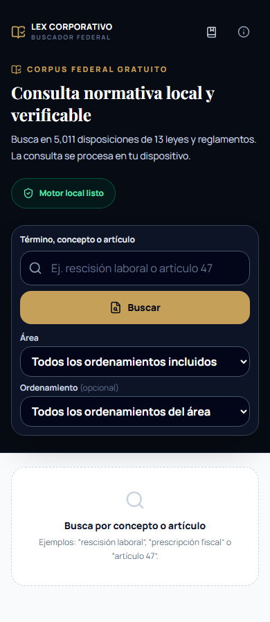
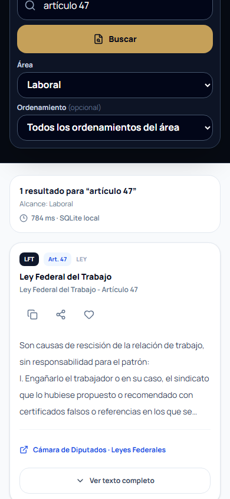
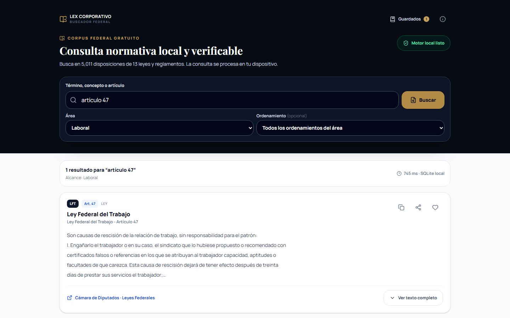
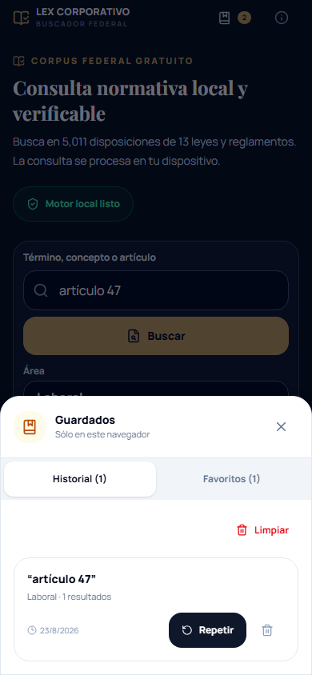
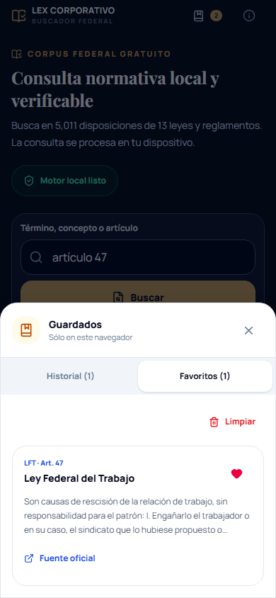
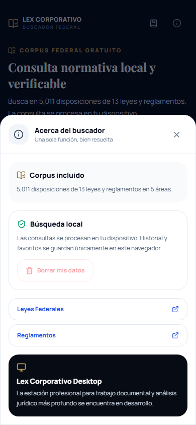
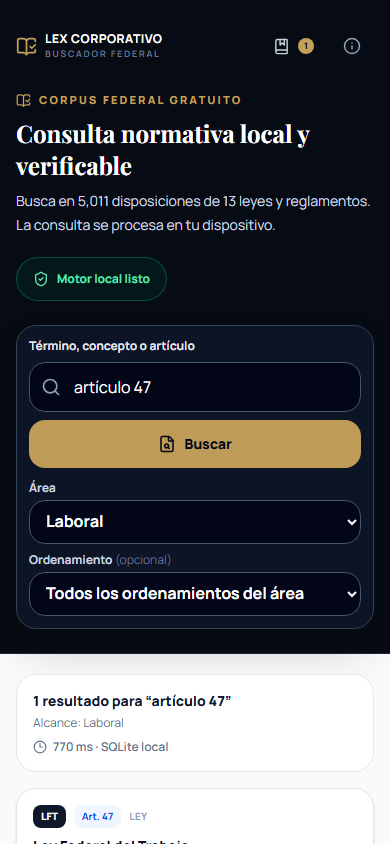
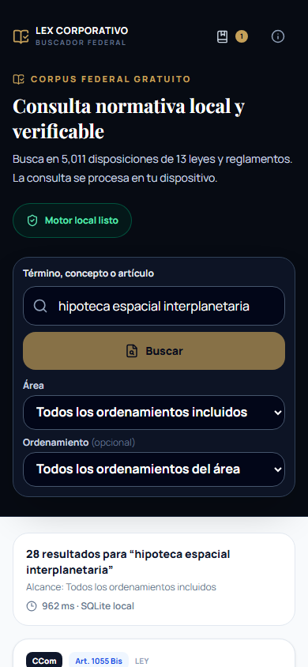
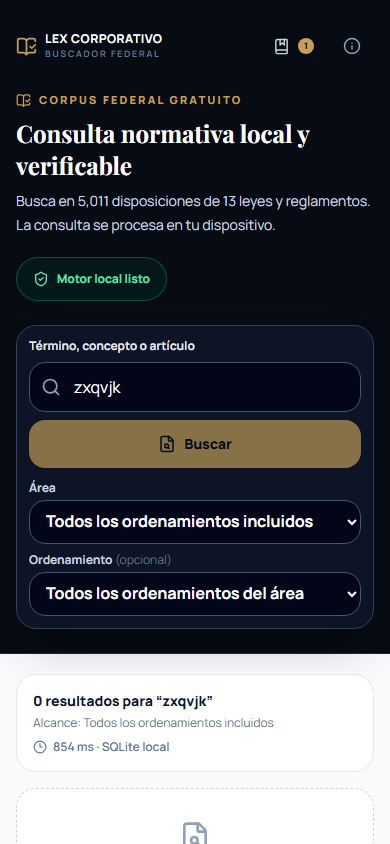
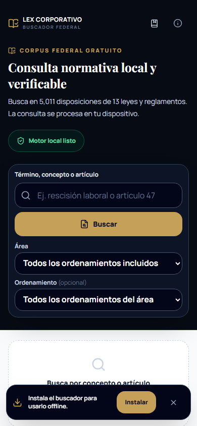

# Auditoría de interfaz y productización

Fecha: 23 de agosto de 2026  
Repositorio: Lex-Corp-PAW  
Branch/commit auditado: `master` / `4fbbd0a`

## Veredicto

La aplicación ya tiene una propuesta de producto clara: un buscador jurídico federal gratuito, local, sobrio y enfocado en una sola función. El recorrido principal funciona en móvil, escritorio y sin conexión. Está cerca de una beta pública, pero no debería presentarse todavía como un buscador jurídico plenamente productizado sin resolver tres riesgos: relevancia de consultas compuestas, trazabilidad temporal del corpus y accesibilidad de los paneles modales.

## Recorrido auditado

1. **Entrada y formulario de búsqueda — Salud buena.** La función, cobertura y promesa local se entienden de inmediato. El formulario cabe en el primer bloque y los controles principales respetan una ergonomía móvil razonable.
2. **Consulta y resultados — Salud parcial.** La búsqueda exacta de `artículo 47` dentro de Laboral devuelve un resultado verificable en menos de un segundo durante una carga en frío. En móvil, el resultado aparece debajo de un bloque de búsqueda alto y no se lleva el foco o el desplazamiento al resultado.
3. **Lectura y acciones del artículo — Salud buena.** Código, artículo, ley, extracto, fuente oficial, copia, compartir, favoritos y expansión están disponibles. Falta información temporal de la versión normativa y una medida de lectura más estrecha en escritorio.
4. **Historial y favoritos — Salud buena con ambigüedad.** Ambos se guardan localmente y el panel móvil es claro. El contador de cabecera suma historial y favoritos; después de una búsqueda y un favorito muestra `2`, aunque sólo existe un favorito.
5. **Información y puente a Desktop — Salud parcial.** Explica privacidad, corpus y fuentes oficiales. El bloque de Desktop es discreto y honesto, pero no ofrece una siguiente acción como conocer el producto o solicitar acceso anticipado.
6. **Offline e instalación — Salud buena con deuda de acabado.** La aplicación recargó y buscó sin conexión mediante el service worker. Existe un banner de instalación compacto. El manifiesto declara idioma inglés, no incluye capturas y declara tamaños 192/512 para un PNG real de 640×640.

## Evidencia visual

### Inicio móvil

### Resultado móvil

### Resultado en escritorio

### Historial y favoritos

### Información y puente a Desktop

### Consulta offline

### Coincidencias imprecisas

La consulta `hipoteca espacial interplanetaria` devolvió 28 resultados porque el ranking acepta coincidencias de cualquier término sin indicar que la coincidencia es parcial.

### Estado de cero resultados

### Instalación PWA

El siguiente estado usa el componente real de la aplicación activado mediante un evento de instalación simulado; no representa el diálogo nativo del sistema operativo.

## Fortalezas

- Identidad visual sobria y apropiada para un producto jurídico: tinta oscura, papel claro, oro contenido y jerarquía editorial.
- Propuesta directa y cuantificada: 5,011 disposiciones, 13 instrumentos y cinco áreas.
- Búsqueda exacta por artículo, filtros dependientes por área y ordenamiento, fuente oficial y advertencia de cotejo.
- Controles táctiles de 44 px en casi todo el recorrido, input de 16 px y navegación principal por teclado con foco visible.
- Historial y favoritos locales, acciones de copiar/compartir y lectura completa sin introducir módulos ajenos al buscador.
- Service worker activo, recarga offline funcional y consulta local exitosa.

## Riesgos priorizados

### P0 — Antes de beta pública

1. **Relevancia de consultas compuestas.** El ranking suma puntos si aparece cualquiera de los términos. La interfaz no indica coincidencia parcial ni resalta qué palabra produjo cada resultado. Definir coincidencia por frase/todos los términos como comportamiento por defecto, ofrecer ampliación controlada y mostrar por qué coincide cada resultado.
2. **Confianza temporal del corpus.** La interfaz enlaza la fuente y advierte verificar, pero no muestra versión del corpus, fecha de actualización, última reforma o fecha de publicación por instrumento. Añadir metadatos visibles y una página o panel de cobertura/versionado.
3. **Paneles modales no accesibles por teclado.** El panel tiene `role="dialog"`, pero el foco permanece en el fondo, el contenido de fondo sigue en el orden de tabulación, no existe trampa de foco y `Escape` no cierra. Implementar foco inicial, retorno de foco, fondo inerte, ciclo de tabulación y cierre con Escape.

### P1 — Productización del recorrido

4. **Continuidad móvil después de buscar.** Tras enviar, el bloque oscuro conserva toda su altura y el resultado comienza debajo. Llevar foco/desplazamiento al resumen, colapsar la introducción después de la primera consulta o convertir el buscador en una barra compacta persistente.
5. **Contador de biblioteca ambiguo.** No sumar historial y favoritos bajo un icono que se interpreta como guardados. Mostrar una etiqueta de biblioteca o separar los contadores.
6. **Puente a Desktop sin acción.** Mantener el tono discreto, pero añadir `Conocer Lex Corporativo Desktop` o `Solicitar acceso anticipado`; no prometer descarga, precio o disponibilidad de producción.
7. **Manifiesto instalable incompleto.** Cambiar `lang` a `es-MX`, generar iconos reales 192/512 y maskable, añadir capturas móvil/escritorio y comprobar el prompt en Android/Chrome y el flujo manual de iOS.
8. **Estado offline por verificar en dispositivo real.** La búsqueda offline funcionó, pero la emulación siguió mostrando `Motor local listo` en lugar de `Modo sin conexión`. Sincronizar el estado al montar y probar eventos online/offline en navegadores físicos.

### P2 — Claridad y acabado

9. Limitar el ancho de lectura del texto normativo en escritorio a aproximadamente 70–80 caracteres por línea.
10. Sustituir `827 ms · SQLite local` por una señal orientada al usuario, como `Resultado local`; conservar el tiempo sólo como diagnóstico.
11. Convertir los ejemplos iniciales en búsquedas accionables y, cuando exista historial, mostrar consultas recientes.
12. Añadir etiquetas visibles o tooltips a copiar, compartir y favorito; los nombres accesibles ya existen.
13. Confirmar o permitir deshacer `Limpiar` en Historial/Favoritos, igual que ya se confirma `Borrar mis datos`.
14. Usar un `header`/banner semántico para la cabecera visual y corregir el objetivo táctil de Guardados móvil, medido en 41×44 px.

## Puerta de salida recomendada

- Pruebas de relevancia con consultas jurídicas canónicas, consultas compuestas, artículos exactos y cero resultados.
- Pruebas automatizadas de foco, Escape, retorno de foco y tabulación en ambos paneles.
- Versión y fecha del corpus visibles, con criterios claros de actualización.
- Auditoría del manifiesto, iconos y experiencia de instalación en Android e iOS.
- Verificación manual con lector de pantalla, zoom al 200 %, alto contraste y dispositivos físicos.

## Límites

La auditoría se ejecutó con Chrome en modo automatizado sobre una vista previa local. No valida exactitud, vigencia ni integridad jurídica del corpus; tampoco acredita cumplimiento WCAG completo. No se probaron lectores de pantalla, Safari/iOS, instalación nativa real, Web Share en un dispositivo físico ni el contenido externo de las fuentes oficiales.
